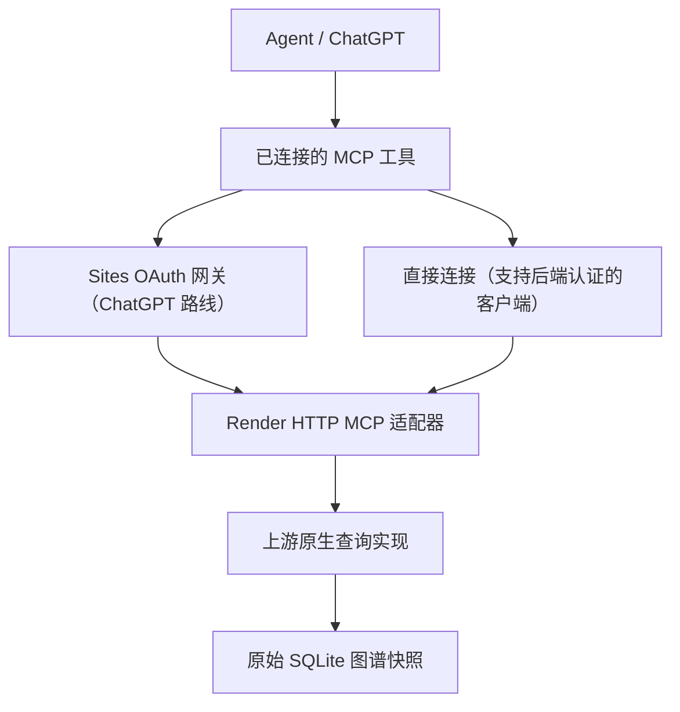
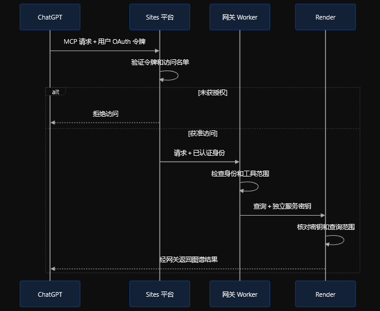

# 完整方案

## 为什么需要远程入口

插件包能保存二进制，不意味着聊天宿主会把二进制挂载到执行环境。文本 skill 读取能力也不意味着具备程序执行能力。改变压缩格式或执行权限，不能增加宿主没有的执行接口。

本模板把程序执行交给 Render，把工具调用交给远程 MCP。聊天宿主只需要连接能力。

## 单一插件

同一 canonical MCP 连接提供五个查询工具、初始化使用指令和工具级说明。Reader Engine 是 Render 中的实现组件，不创建第二个插件。用户只连接 Codebase Graph Reader。

## 原生引擎

`backend/native/standalone_main.c` 链接固定版本上游的嵌入 API。它建立单进程 MCP 实例、关闭后台任务、设置 analysis 工具 profile。

它不启动上游共享守护进程，因此不走守护进程版本协调所用的 `/proc/<pid>/exe` 路径。它不会关闭操作系统沙箱，也不是未经修改的上游发行版可执行文件。

## HTTP 适配器

`backend/server.py` 通过原生 stdio `tools/list` 获取真实 schema，再公开五个查询工具；适配层另提供 `add_index` 注册接口。每次调用由原生 `--call` 入口处理；Cypher 也交给上游引擎，不用 Python SQL 重新实现。

适配器只允许配置的项目，将数据库完整性校验放在调用前后，限制并发数，并保留原生错误、分页及截断语义。独立快照缓存中不能混入其他项目。

## 两层认证

Render `/mcp` 使用服务端 Bearer 密钥保护。`/health` 不返回私人图谱信息。

ChatGPT 路线额外使用 Sites 的平台 OAuth 与 owner-private 访问控制。网关仅信任 Sites 注入的用户身份，去掉客户端身份、Authorization 和 Origin，再向固定 Render origin 发送服务端凭据。

通用 Cloudflare Worker 不会自动提供 Sites 的信任边界。不要在公网裸 Worker 中信任客户端可自行设置的 `oai-authenticated-user-id`。

下图展示 ChatGPT 路线的请求顺序与认证边界。未获授权的请求在 Sites 平台被拒绝；获准请求携带平台认证后的身份进入网关，再由网关使用独立服务密钥调用 Render。

## 快照来源

查询始终读取 `CBM_CACHE_DIR` 中的本地 `.db`，不访问 GitHub，也不会调用下载脚本。构建阶段准备一次快照；已存在且校验匹配的文件直接复用，即使没有下载 URL 或网络也能通过准备步骤。临时 URL 刷新属于部署操作，不属于每次查询。运行时校验读取本地字节，原生引擎使用同一文件。

MCP 宿主可能省略 `_meta`。所以后端在 `structuredContent.graph_snapshot` 和追加文本块中同时返回仓库、图谱路径及校验值。原生结果的原有字段和第一个文本块保持不变。

不要把这些来源字段误认为最新工作树状态。已有索引生成 Actions 发布新图谱后，通过独立 OIDC 入口自动刷新缓存；版本未变时只比较小型元数据。新文件经字节校验和原生引擎验证后原子激活，不需要重建或部署服务。见 [自动刷新](automatic-refresh.md)。

## 资源边界

下载脚本默认限制快照为 256 MiB。后端为了完整性校验会读数据库字节；查询引擎也需要内存。大型项目应测量内存、查询时间和冷启动，调整实例与设计。改变大小上限不等于增加可用内存。

`index_catalog.py` 负责私有配置和每项目缓存目录。`Catalog` 使用真实 `project` 分派五个原生接口，汇总分页的 `list_projects` 为每项目保留来源。`github_indexes.py` 负责 GitHub 链接注册、签名原始下载校验、注册表原子保存和远程 blob 检查。已有发布流水线的 OIDC 策略与 run 水位也按项目隔离。

所有项目仍属于同一个 owner-private App 的授权范围；这不是按访客隔离的多租户服务。增量索引和源码索引生成不属于阅读器职责。
